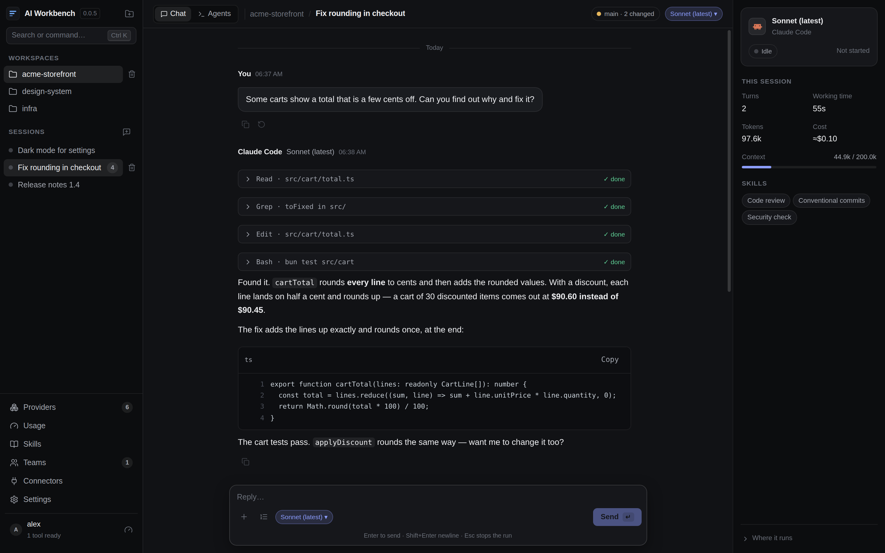
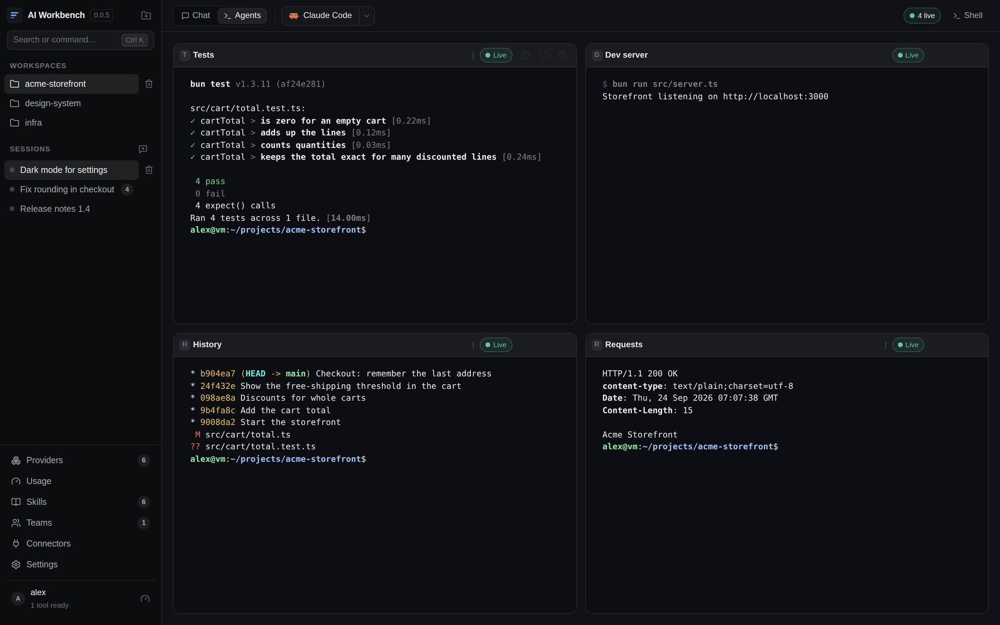
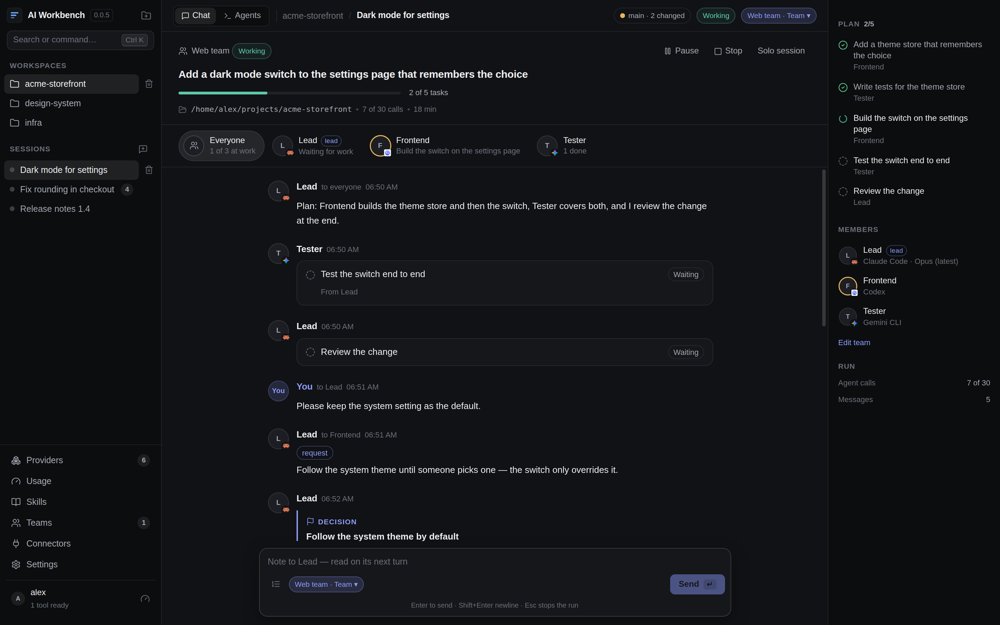
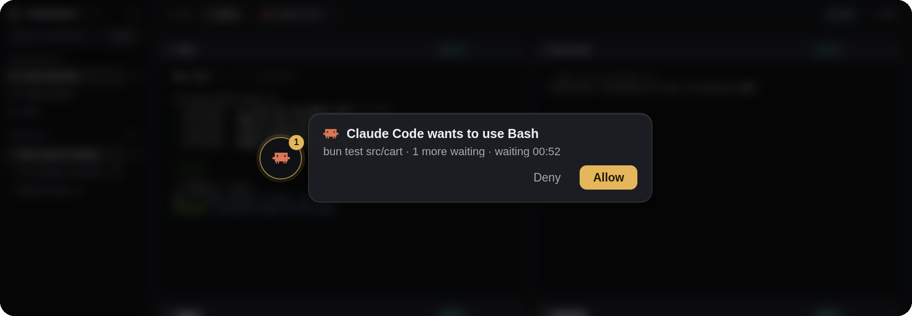
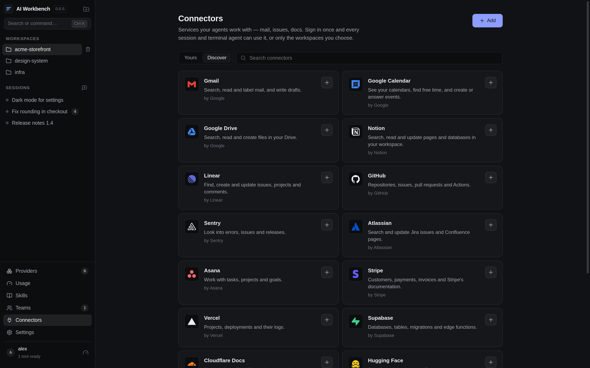
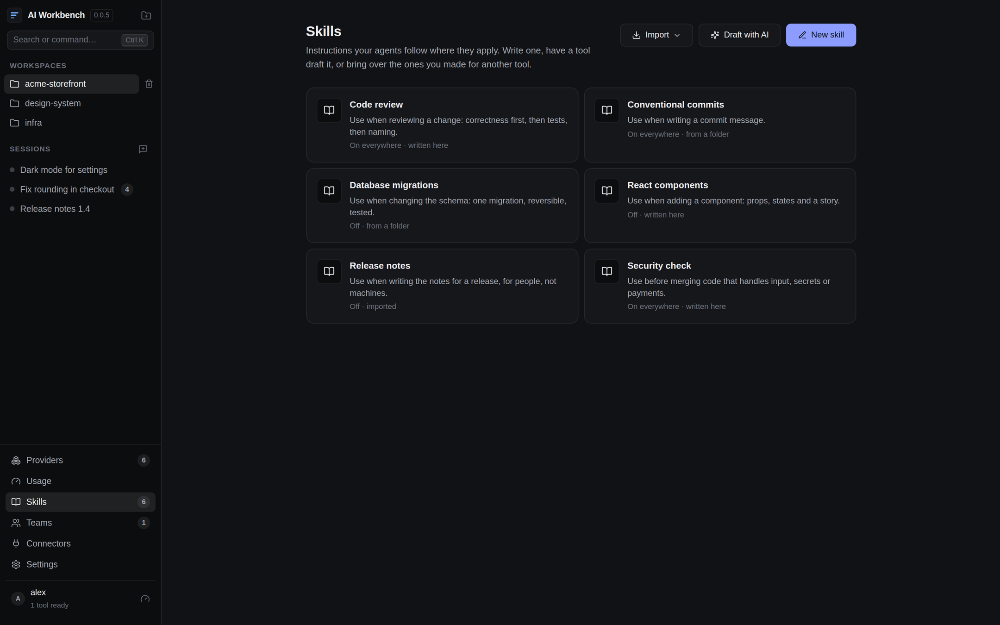
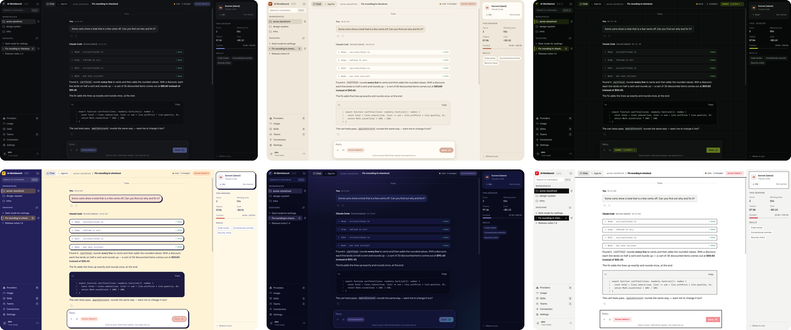
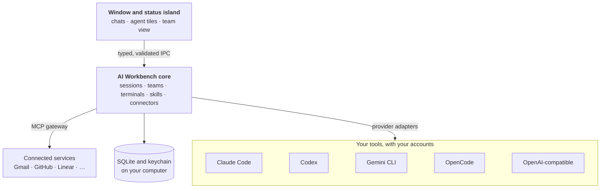

<div align="center">


# AI Workbench

**One calm desktop app for all your AI coding agents.**

Claude Code, Codex, Gemini CLI and OpenCode in chats, terminals and teams that work together —
with your services, your skills, and a small island that tells you when one of them needs you.

[](https://github.com/JackyWein/AI-Workbench/releases/latest)
[](https://github.com/JackyWein/AI-Workbench/actions/workflows/ci.yml)


[**Download**](https://github.com/JackyWein/AI-Workbench/releases/latest) ·
[How it works](#how-it-works) ·
[Supported tools](#supported-tools) ·
[Build from source](#build-from-source)

</div>

<br />

<picture>
  <source media="(prefers-color-scheme: light)" srcset="docs/images/chat-light.png" />
  
</picture>

<sub>The screenshots show demo data: a small shop project and made-up conversations, rendered by the real application.</sub>

## Why

You probably use more than one AI coding tool. Each lives in its own terminal, with its own
sign-in, its own idea of your project and no idea what the others are doing.

AI Workbench puts them side by side on your projects **without replacing them**. It drives the
real command line tools you already installed, with the accounts you already signed in to —
nothing is proxied, scraped or re-sold. On top it adds what none of them has alone: one place for
your workspaces, teams of agents that hand work to each other, services every agent can use after
one sign-in, and a quiet companion that tells you when an agent is waiting for you.

**Simple by default. Powerful on demand.**

## What you can do

### Talk to any tool, in any project

A **workspace** is a folder on your computer. Inside it, every **session** is one conversation
with one tool and model — pick them in the box you type in, and
switch whenever you like. Answers stream in with their tool calls folded away, code is ready to
copy, and **+** attaches files and screenshots. The panel beside the chat shows what the session
has cost so far, from the tool's own numbers; <kbd>Ctrl</kbd> <kbd>`</kbd> opens a shell, the
files and the git changes of the workspace. Close the app and come back tomorrow: the conversation
continues where it stopped. Folders on another machine can be opened over SSH, to browse and edit
their files.

### Run agents side by side



The **Agents** view is a grid of real terminals: the tools' own interactive interfaces or plain
shells, as many as you need. They keep running when you switch views or close the window, and
each tile shows what its session used, where the tool reports it. <kbd>Ctrl</kbd> <kbd>Shift</kbd> <kbd>A</kbd> switches
between chat and agents.

### Let a team work on one goal



Pick a **team** in any session and give it a goal. A lead breaks the goal into tasks and hands
them out; the members — each on the tool and model you chose — work at the same time, ask each
other questions, publish files, record decisions and report back. You watch it as a
conversation, follow one member, add a note for the lead, or pause and stop the run. Every run
has limits (calls, tasks, runtime, failures), so a team cannot burn through an account overnight.

### Never miss an agent that needs you



The **status island** floats above your other windows. It says which agents are working and when
one has finished — and when one waits for a permission, you answer right there: Claude Code,
Codex, OpenCode and Gemini CLI each ask through their own permission system, which stays in
charge. Drag the island to any edge of the screen, or switch it off.

### Give your agents your services — sign in once



**Connectors** are the services agents work with: mail, calendars, issues, docs, deployments.
Choose one, sign in in your browser, and every chat, terminal agent and team can use it — or only
the workspaces you choose. Your own MCP servers are added the same way. Sign-in tokens stay in
your system's keychain; the tools reach a service through a small gateway on your computer and
never see them.

### Teach them how you work



**Skills** are short instructions your agents follow where they apply — how you review a change,
write a commit, name things. Write one yourself, let one of your tools draft it from a sentence,
or bring over the skills you already made for Claude Code, Codex, Gemini CLI or OpenCode — a skill
made for one tool then works for all of them. Switch each on everywhere, per workspace or per
session.

### Make it look the way you like



Pick a **theme** under Settings and the whole app changes with it — colours, type, shapes, the
terminals and the status island: **Quiet** (dark, light or following your system), warm
**Atelier** with serif headings, dense **Mission Control** in lime on black, bold
**Playground** with thick outlines, **Aurora** in night blue and violet light, and strict black
and red **Swiss**. The typefaces ship with the app, and every theme is checked to stay readable.

## How it works



- **Your tools stay in charge.** Each tool is reached through an adapter that starts the real
  program the way you would, and turns what it prints into one common stream of events.
  Permissions, sandboxes and sign-ins remain the tool's own; the app never works around them.
- **One core for all of them.** Sessions, teams, terminals, skills and connectors never branch on
  a tool's name. A new tool is an adapter, mostly a profile of its flags and output.
- **Nothing is invented.** Usage, limits and cost are what the tools report. Where a tool reports
  nothing, the app says so instead of estimating.
- **Local and private.** Everything lives in a SQLite database on your computer. Secrets go to
  the system's keychain — without one, the app refuses to store them rather than writing them in
  the clear. The window has no access to Node or to your secrets; every request it makes is
  validated.

## Supported tools

| Tool | Chat sessions | Agent tiles | Status island | Models |
|---|:---:|:---:|:---:|---|
| **Claude Code** | ✓ | ✓ | Allow and deny | Claude Code's own model names |
| **Codex** | ✓ | ✓ | Allow and deny shell commands | The list Codex reports |
| **Gemini CLI** | ✓ | ✓ | Allow and deny shell commands ¹ | Gemini CLI's model names |
| **OpenCode** | ✓ | ✓ | Allow, deny and answer questions | Every model OpenCode can reach |
| **OpenAI-compatible servers** — Ollama, llama.cpp, vLLM, a company gateway | experimental | — | — | The server's list |

¹ After a one-time setup under Providers, which installs a small extension with Gemini CLI's own
installer.

Each tool's path through the app was checked against the real program, driven by a local
stand-in model. What a real account adds — its limits and the models it may use — is verified for
Claude Code; for Codex, OpenCode and Gemini CLI it is not tested yet. A profile for the
Antigravity CLI ships but is not verified, and the app says so.

## Download

Get the latest version from [Releases](https://github.com/JackyWein/AI-Workbench/releases/latest).

| Platform | File | Updates |
|---|---|---|
| Windows | `…-windows-x64.exe` (installer) or `…-windows-portable-x64.exe` | The installer updates itself; the portable version tells you |
| macOS | `…-macos-arm64.dmg` (Apple silicon) or `…-macos-x64.dmg` (Intel) | The app tells you, you install |
| Linux | `…-linux-x86_64.AppImage` or `…-linux-x64.tar.gz` | The AppImage updates itself; the archive tells you |

The packages are **not code signed** yet. Windows SmartScreen and macOS Gatekeeper warn on the
first start; on macOS open the app once with right click → Open, or run
`xattr -dr com.apple.quarantine "/Applications/AI Workbench.app"`.

Install the tools you want to use (Claude Code, Codex, Gemini CLI, OpenCode) and sign in to them
as usual; AI Workbench finds them on its own and shows what it found under **Providers**.

## Build from source

You need [bun](https://bun.sh) 1.3 and Node.js 22.

```bash
bun install
bun run dev        # the app, with hot reload
bun run verify     # lint, typecheck, tests, build and a real start of the app, twice
```

A built-in **Mock Provider** lets you try everything without spending any quota: type `/tool`,
`/error` or `/slow` in a message to see simulated tool calls, failures and delays.

## Project status

AI Workbench is young (0.0.x) and moves quickly. [`PROGRESS.md`](PROGRESS.md) lists what is
verified — measured only from acceptance criteria that `bun run verify` actually proves — and
what is still open. [`HANDOFF.md`](HANDOFF.md) says where things stand right now.

## Documentation

| File | Contents |
|---|---|
| [`AI_WORKBENCH.md`](AI_WORKBENCH.md) | The specification |
| [`ARCHITECTURE.md`](ARCHITECTURE.md) | How the running system is put together |
| [`PROVIDERS.md`](PROVIDERS.md) | The provider contract, and how to add a tool |
| [`TEAM_SYSTEM.md`](TEAM_SYSTEM.md) | How teams of agents work together |
| [`STATUS_ISLAND.md`](STATUS_ISLAND.md) | The floating status island |
| [`SECURITY.md`](SECURITY.md) | Renderer isolation, IPC validation, secrets |
| [`DEVELOPMENT.md`](DEVELOPMENT.md) | Setup, commands, layout, conventions |
| [`CLAUDE.md`](CLAUDE.md) | Rules for coding agents working in this repository |
| [`docs/adr/`](docs/adr) | Architecture decision records |
